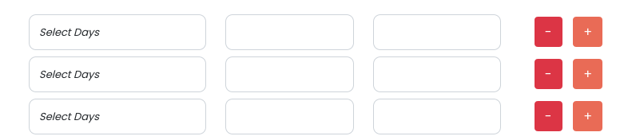

# jQuery Plugin to dynamically add more forms

# Objective
As a developer our objective is to make things easy. This jQuery plugin will help you to add more forms dynamically. It will setup input naming as an array. You can disable naming as well.



# Pre-requirements
    - Latest jQuery  

# How to use
# Step 1 : 
Create a form element and inside that form we need a `wrapper div` > `group div` > `add button and remove button`.
The concept is that it will clone the `group element` and append to the main `wrapper element`, So, wrapper will not going to change, only group elements will be add and remove.
Each group element will consist `add button` and `remove button` which will help us to add and remove group elements. 

```HTML
    <form action="" method="post">
        <div class="" data-x-wrapper="employees">
            <div class="" data-x-group>
                <input type="text" name="emp_name">
                <input type="text" name="emp_code">
                <input type="text" name="emp_position">

                <div>
                    <button type="button" class="btn btn-danger" data-add-btn>-</button>
                    <button type="button" class="btn btn-primary" data-remove-btn>+</button>
                </div>
            </div>
        </div>
        <div class="action-buttons">
            <button type="submit" class="btn btn-primary">Submit</button>
            <button type="button" class="btn btn-outline-danger">Cancel</button>
        </div>
    </form>
```

# Step 2: 
Initialize the plugin like below:

```JavaScript
$( selector ).replicate( options );
```

```
options: {
   disable-naming: boolean,
   wrapper: string,
   group: string,
   add-btn: string,
   remove-btn: string
}
```

After applying this plugin, it will change the inputs name like below, and the indexes will be 0,1,2,3....and so on..

```HTML
    <input type="text" name="employees[0][emp_name]" data-name="emp_name">
    <input type="text" name="employees[0][emp_code]" data-name="emp_code">
    <input type="text" name="employees[0][emp_position]" data-name="emp_position">
```

So, when you submit this form you will get the `employees` array like below,

```
[
    [
        'emp_name' => ***,
        'emp_code' => ***,
        'emp_position' => ***
    ],
    [
        'emp_name' => ***,
        'emp_code' => ***,
        'emp_position' => ***
    ],
    [
        'emp_name' => ***,
        'emp_code' => ***,
        'emp_position' => ***
    ],
    ...
]
```

If you have used the `disable-naming: true,` then it will not change the input naming to an array.

# Contributor
[Satpal Bhardwaj](https://sbsharma.com/javascript/)

# Feel free to reach me for any query
<a target="_blank" href="https://www.facebook.com/Sbsharma-2798360506847821"></a>
<a target="_blank" href="https://twitter.com/Ss101Bhardwaj"></a>
<a target="_blank" href="https://www.linkedin.com/in/satpal-bhardwaj-5a76b4134"></a>
<a target="_blank" href="https://codepen.io/sb_sharma"></a>
